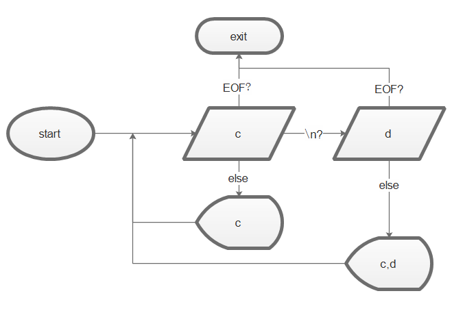

# fix1A

修正輸出文字檔尾換行和eof

## 問題

dbase資料庫經copy to輸出文字檔後在檔尾多了0D0A1A三個字元導致銀行軟體無法正常操作

## 方案

0D0A是換行字元  
1A是EOF字元  
那就把檔尾的換行和多出的一碼清掉就好了

### C++

`fix1A.exe 123.txt >tmp`  
`del 123.txt`  
`ren tmp 123.txt`

### Python

~~換行切片~~讀string,如果最後一~~行~~字是1A(26)就~~刪掉~~  
~~輸出,最後一行不送出換行~~去尾2元素(0D0A看作1字)  

`python fix1A.py 123.txt`

### Go

~~換行切片,如果最後長度小於等於1就縮尾1  
輸出,最後一行不送出換行~~  
讀bytelist,如果最後是26就縮尾3元素存回

`go run Fix1A.go 123.txt`

### java

~~行取再合併,如果長度<=1就跳過  
最後trim去尾換行~~  
啊就直接讀完trim去尾就好了  

`java.exe" Fix1A.java 123.txt`

### delphi(lazarus)

Stringlist讀完trim去尾~~回存~~  
回存自帶換行,直接輸出  

`fix1A.exe 123.txt > tmp`  
`del 123.txt`  
`ren tmp 123.txt`

### dart

讀bytes陣  
若可移除1A(26)就再縮尾2元素

`dart.exe Fix1A.dart 123.txt`

### Ruby

重新安裝中...

### kotlin

readbytes如果最後元素為26就縮尾3元素存回
  
`kotlinc Fix1A.kt -include-runtime -d Fix1A.jar`  
`java -jar'Fix1A.jar 123.txt`

## 還有嗎

+ trim很好用
+ list [:]超方便
+ 0D0A是一字還兩字?以前是用text或byte看,現在好像用encode解決
+ encode,decode,utf8,utf16,utf32,ascii,latin1 還好其實可以不處理big5
